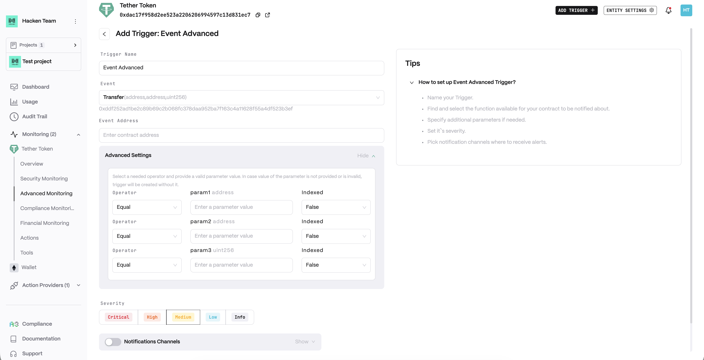
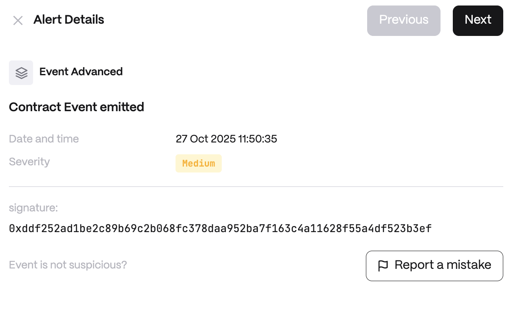

**Detector Configuration**

<Steps>
  <Step title="Name">
    Enter a descriptive name for your trigger, for example: "Event Advanced".
  </Step>
  <Step title="Event">
    Configure the event to monitor.
  </Step>
  <Step title="Event Address">
    Set the contract address emitting the event.
  </Step>
</Steps>

**Alert example**

