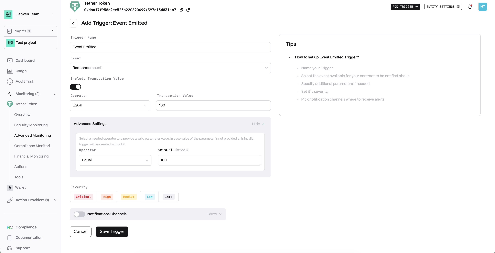
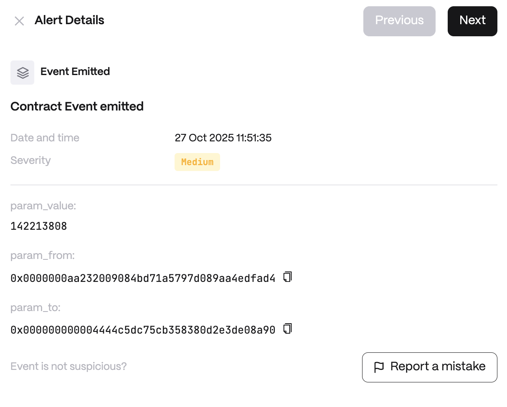

**Detector Configuration**

<Steps>
  <Step title="Name">
    Enter a descriptive name for your trigger, for example: "Event Emitted".
  </Step>
  <Step title="Event">
    Execution of certain actions within the contract.
  </Step>
  <Step title="Include Transaction Value">
    Configure the transaction value filter:
    - *Operator*
    - *Transaction Value*
  </Step>
</Steps>

**Alert example**

