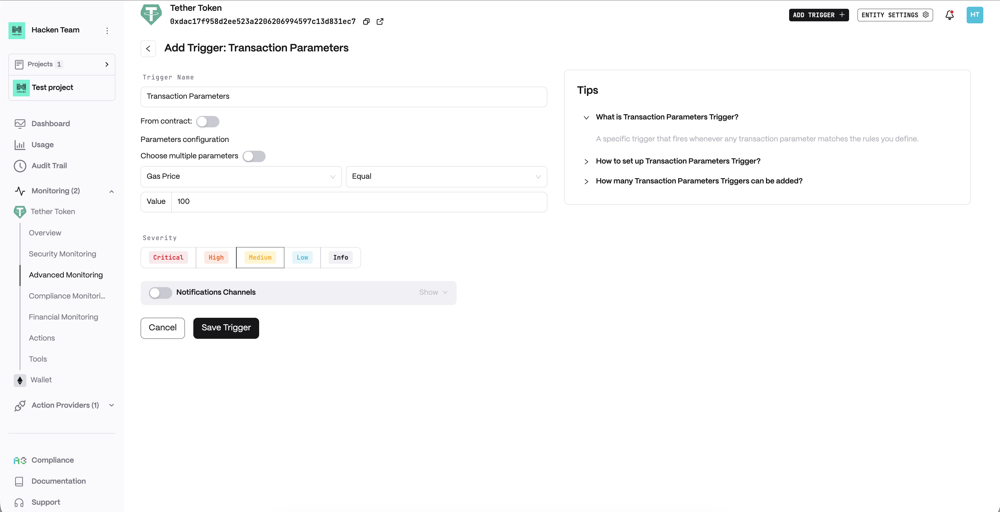
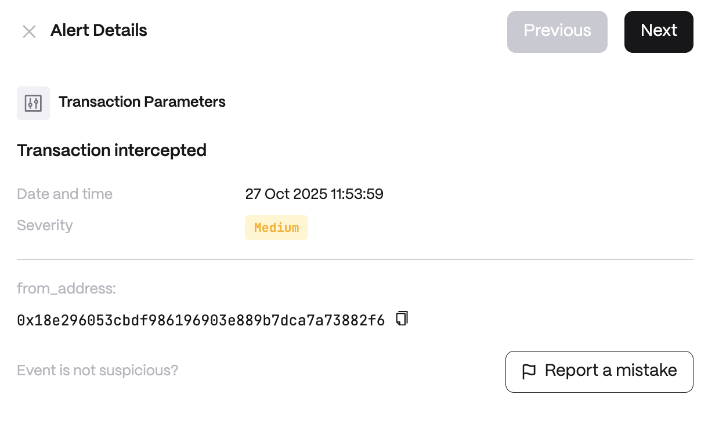

**Detector Configuration**

<Steps>
  <Step title="Name">
    Enter a descriptive name for your trigger, for example: "Transaction Parameters".
  </Step>
  <Step title="From contract">
    Specify whether to filter by the originating contract.
  </Step>
  <Step title="Parameters configuration">
    Configure the parameter rules:
    - *Choose multiple parameters*
    - *Parameter*
  </Step>
</Steps>

**Alert example**

