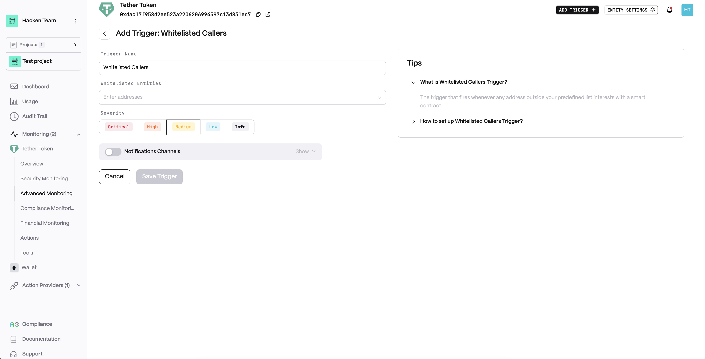
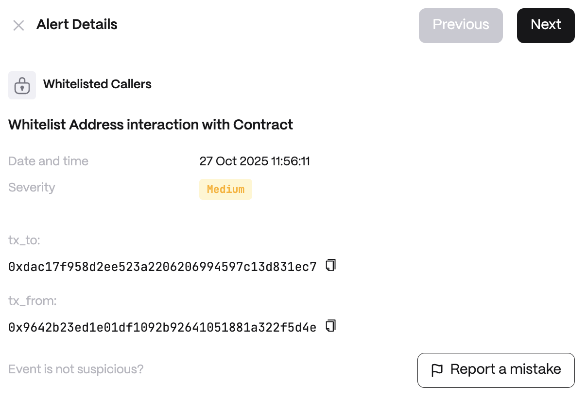

**Detector Configuration**

<Steps>
  <Step title="Name">
    Enter a descriptive name for your trigger, for example: "Whitelisted Callers".
  </Step>
  <Step title="Whitelisted Entities">
    A list of addresses.
  </Step>
</Steps>

**Alert example**

