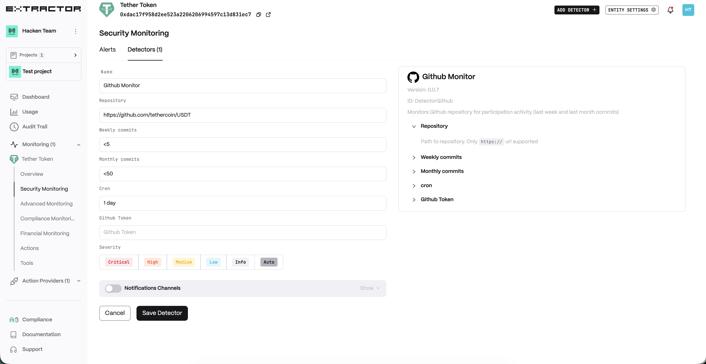
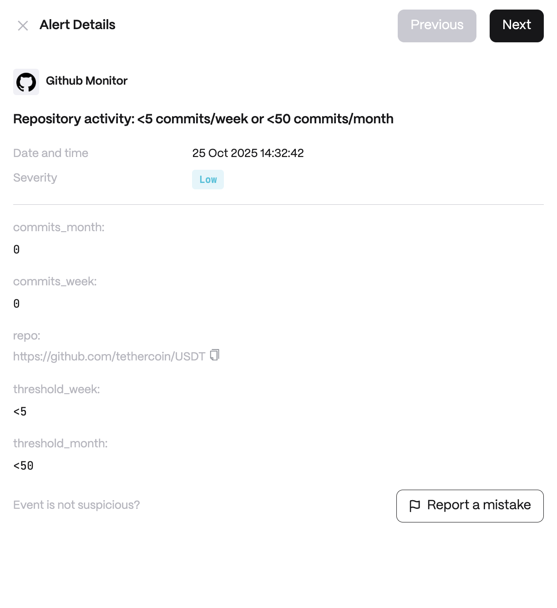

**Behavior**

* Repository Path to repository. Only https:// url supported
* Weekly Commits Weekly aggregated commit threshold
* Monthly Commits Monthly aggregated commit threshold

**Use cases**

* Monitor repo inactivity for early signs of abandoned projects.
* Detect sudden spikes in commits indicating emergency patches.
* Provide due diligence insights to investors on dev activity.

**Detector Configuration**

<Steps>
  <Step title="Name">
    Enter a descriptive name for your monitor, for example: "Github Monitor".
  </Step>
  <Step title="Repository">
    Enter the full URL of the GitHub repository you want to monitor.
  </Step>
  <Step title="Weekly commits">
    Enter the number of commits you expect in a week.
  </Step>
  <Step title="Monthly commits">
    Enter the number of commits you expect in a month.
  </Step>
  <Step title="Cron">
    Enter a cron expression to define the schedule. Cron expression in Quartz syntax, milliseconds value or seconds/minutes/hours/days interval (e.g. `24 hours`)
  </Step>
  <Step title="Github Token">
    Enter `github_token` if repository is private.
  </Step>
</Steps>

**Alert example**

