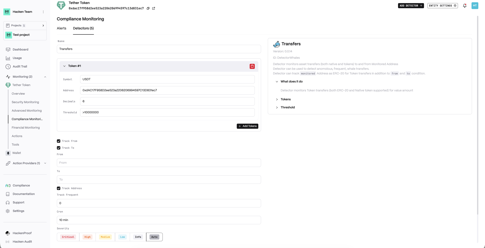
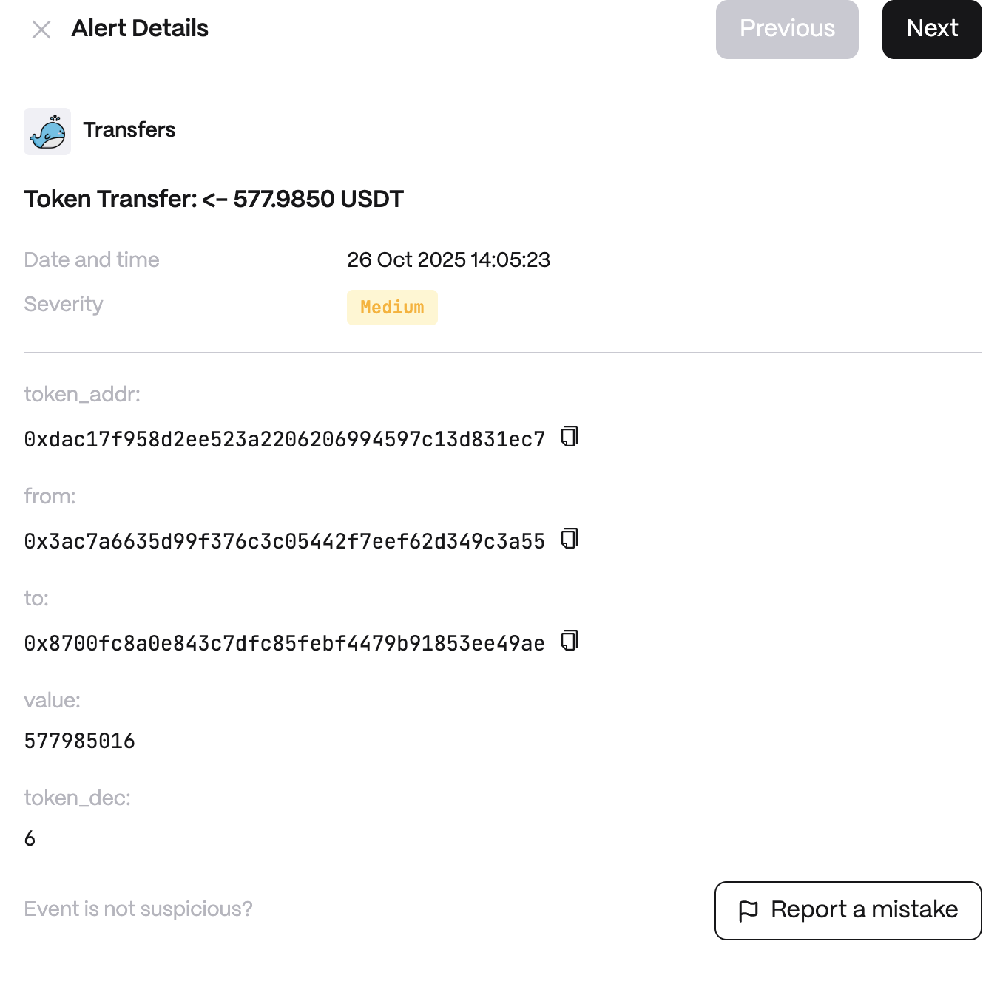

Anomalies examples:

* Large Transfers of ERC-20 or Native tokens
* Frequent Transfers

**Detector Configuration**

<Steps>
  <Step title="Name">
    Enter a descriptive name for your monitor, for example: "Transfers".
  </Step>
  <Step title="Token">
    The token contract address to monitor.
  </Step>
  <Step title="Track From">
    Enable tracking of outbound transfers.
  </Step>
  <Step title="Track To">
    Enable tracking of inbound transfers.
  </Step>
  <Step title="From">
    Specific sender address to monitor.
  </Step>
  <Step title="To">
    Specific recipient address to monitor.
  </Step>
  <Step title="Track Address">
    Address to track for transfers.
  </Step>
  <Step title="Track Frequent">
    Enable frequent transfer anomaly detection.
  </Step>
  <Step title="Cron">
    Enter a cron expression to define the schedule.
  </Step>
</Steps>

**Alert example**

