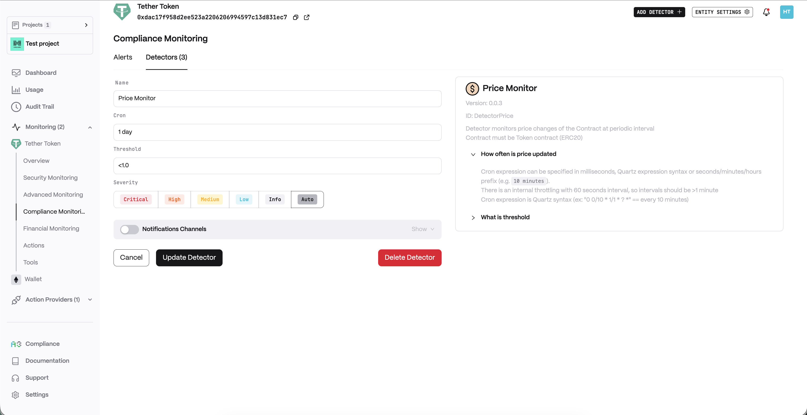
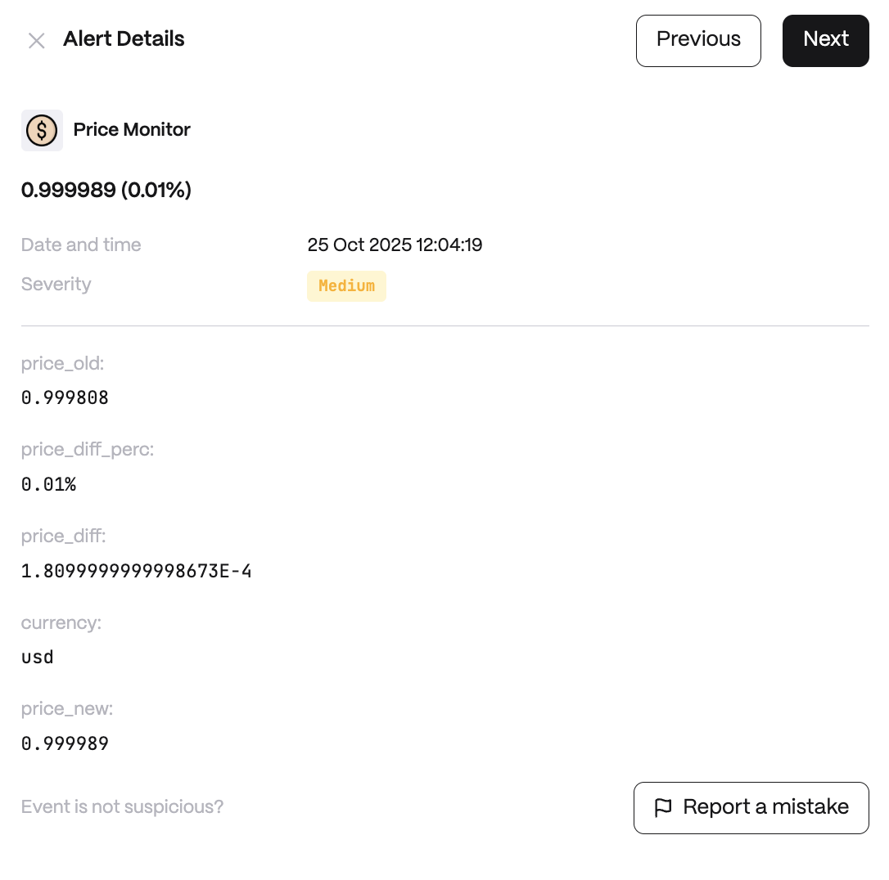

**Behavior**

When to query price:\
`cron` - On Cron interval\
`block` - On every new block

_Source_\
Where to query price:\
`oracle` - On-chain Feed (Chainlink Oracle format)\
`coingecko` - Coingecko Feed

_Currency_\
Currency of the price. Default is `usd`.

<Note>
  Currently supported only for `coingecko` feed. `oracle` feed requires adding Chainlink Oracle Contracts in configuration.
</Note>

**Use cases**

* Alert on sudden price drops of stablecoins or RWAs.
* Detect oracle price manipulation attempts in DeFi protocols.
* Track token price feeds for liquidation risk management.

**Detector Configuration**

<Steps>
  <Step title="Name">
    Enter a descriptive name for your monitor, for example: "Price Monitor".
  </Step>
  <Step title="Cron">
    Configure the cron schedule for when to query the price.
  </Step>
  <Step title="Threshold">
    Set the threshold value that triggers an alert.
  </Step>
</Steps>

**Alert example**

