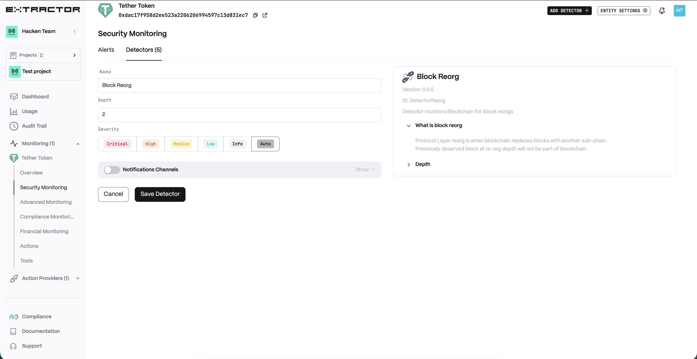
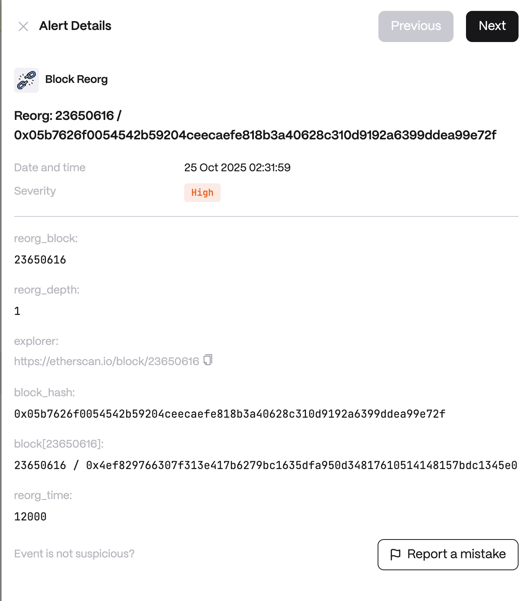

**Behavior**
Protocol Layer reorg is when blockchain found another blockchain tip candidate. Previous observed block will not be part of blockchain

**Use cases**

* Exchange & Custodian Double-Spend Protection - Block reorgs can invalidate previously confirmed transactions, opening the risk of double-spend attacks against exchanges or custodians. The detector alerts whenever a reorg occurs, allowing exchanges to delay crediting deposits or increase confirmation requirements during periods of instability.

* DeFi Protocol Stability Monitoring - A DeFi protocol executes critical operations (liquidations, oracle updates, collateral withdrawals). A reorg can cause these actions to roll back and potentially create inconsistencies. The detector provides early warnings of reorgs, allowing protocols to pause sensitive operations or re-validate contract state.

* Regulatory & Risk Oversight - Regulators or institutional investors require assurance that critical blockchain activity (e.g., settlement, stablecoin issuance) isn't occurring on unstable forks. The detector logs and reports reorg events, creating an auditable trail of chain instability.

## Configuration

<Steps>
  <Step title="Name">
    Enter a descriptive name for your monitor, for example: "Block Reorg".
  </Step>
  <Step title="Reorg Depth">
    Enter the minimum number of blocks that get reorganized to trigger an alert.
  </Step>
</Steps>

**Alert example**

