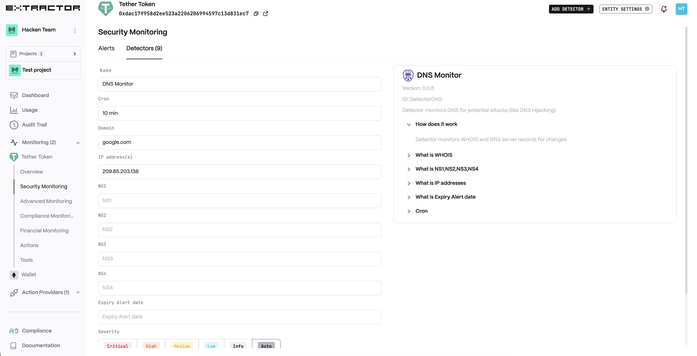
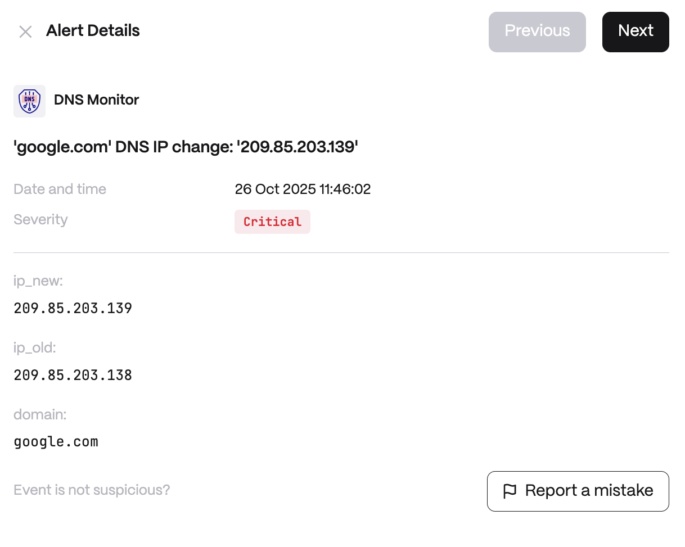

**Behavior**

Monitors WHOIS and DNS server records. Start alerting about Domain expiration before Domain expiration date.

**Use cases**

* Domain Hijacking & Phishing Prevention - An attacker compromises DNS records and redirects users to a malicious clone of a DeFi protocol or exchange website. The detector continuously monitors DNS and WHOIS records for unauthorized changes (e.g., altered A, CNAME, or NS records).

* Operational Continuity & Domain Expiration Alerts - A project's critical domain (API endpoint, wallet interface, or dApp front-end) is at risk of expiring because renewal was overlooked. The detector issues early warnings well before the expiration date.

## Configuration

<Steps>
  <Step title="Name">
    Enter a descriptive name for your monitor, for example: "DNS Monitor".
  </Step>
  <Step title="Cron">
    Enter a cron expression to define the schedule.
  </Step>
  <Step title="Domain">
    The domain name to monitor.
  </Step>
  <Step title="IP address(s)">
    Expected IP address(es) for the domain.
  </Step>
  <Step title="NS1/2/3/4">
    Expected nameserver records.
  </Step>
  <Step title="Expiry Alert date">
    How far in advance to alert before domain expiration.
  </Step>
</Steps>

**Alert example**

