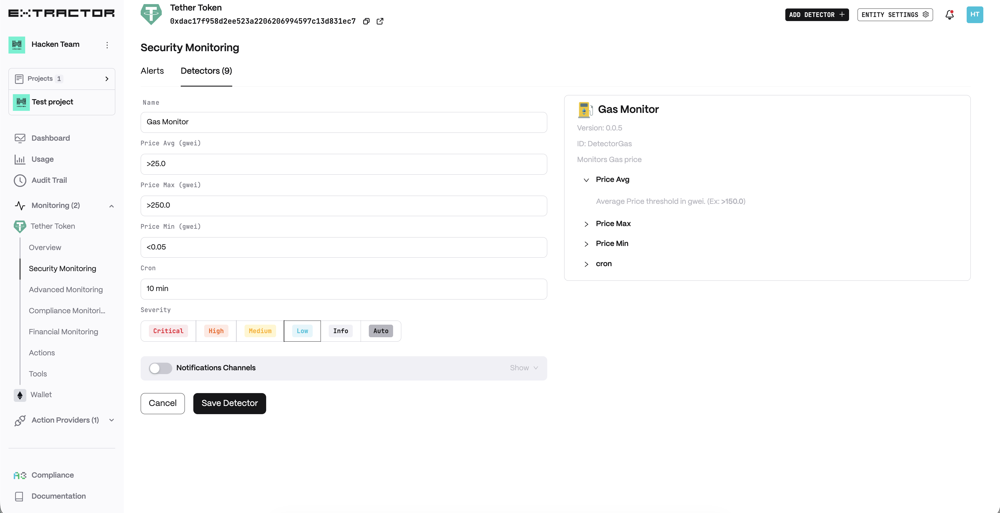
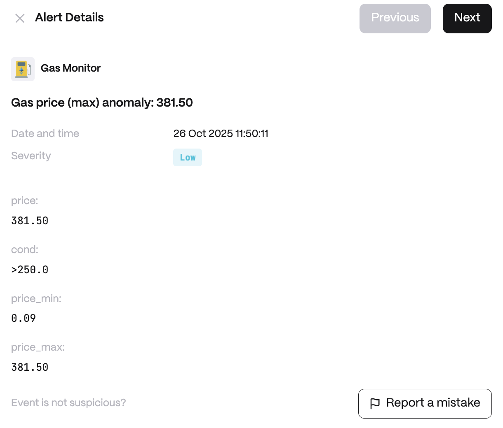

**Behavior**

* _Price Avg_ — Average Price threshold in gwei. (Ex: >150.0)
* _Price Max_ — Max Price threshold in gwei. (Ex: >250.0)
* _Price Min_ — Min Price threshold in gwei. (Ex: &lt;1.0)

**Use cases**

* Detect suspicious drops or high spike in gas usage that could indicate network attack.
* Trading Bot Fee Optimization: optimize transaction timing. The bot's operators define a maximum gas price (say 150 gwei); if the current gas exceeds this, the Gas Monitor event tells the bot to hold off on executing trades.
* Network Congestion Safeguard: automatically safeguard users during extreme network congestion.

## Configuration

<Steps>
  <Step title="Name">
    Enter a descriptive name for your monitor, for example: "Gas Monitor".
  </Step>
  <Step title="Price Avg (gwei)">
    Average price threshold in gwei.
  </Step>
  <Step title="Price Max (gwei)">
    Maximum price threshold in gwei.
  </Step>
  <Step title="Price Min (gwei)">
    Minimum price threshold in gwei.
  </Step>
  <Step title="Cron">
    Enter a cron expression to define the schedule.
  </Step>
</Steps>

**Alert example**

