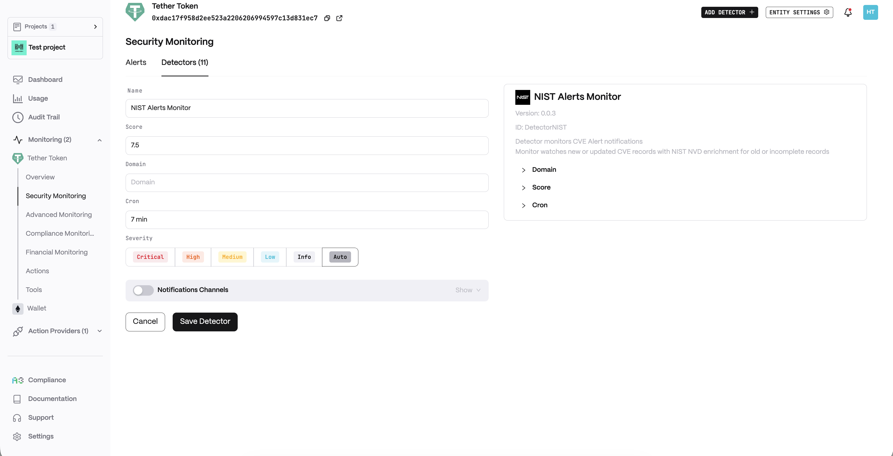
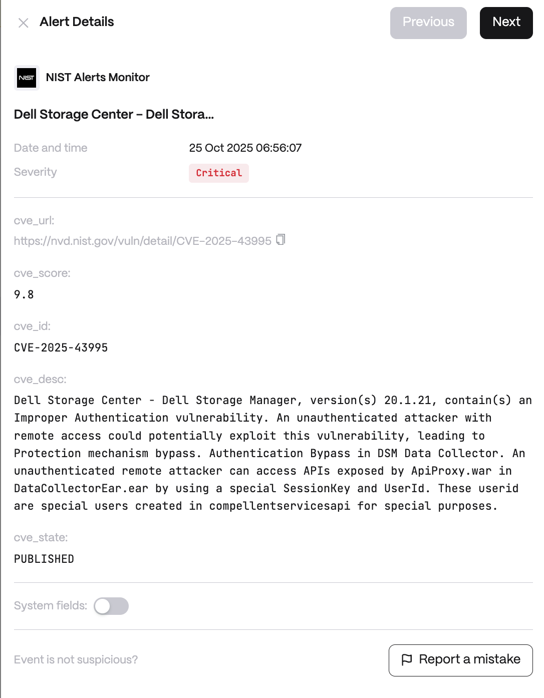

**Behavior**

Analyse and filter by LLM the malicious crypto activity to identify connection and pattern of latest reported threads with clients infrastructure as soon as possible to minimise harmful outcomes.

**Use cases**

* Vulnerability Patch Response: When a critical new CVE (vulnerability) is published in the NIST NVD, the NIST Alerts Monitor notifies the organization's security team. For instance, if a severe flaw in an open-source library (that the company's blockchain nodes or web servers use) appears, the integrated LLM analysis flags that the company's infrastructure is affected. This prompts immediate patching or mitigation before attackers exploit the vulnerability.

* Updated CVE Follow-Up: The NIST Alerts Monitor also watches for updates to existing CVE records. If an older CVE entry is enriched with new data (e.g. higher severity or additional affected components), the monitor catches it and cross-references it with the client's software inventory.

* DevSecOps Integration: A DevSecOps team includes the NIST Alerts Monitor in their CI/CD pipeline to continuously track emerging vulnerabilities relevant to their tech stack. Suppose a popular web framework or smart contract library used by the project gets a CVE entry – the monitor will alert developers and provide an LLM-generated summary of the risk.

## Configuration

<Steps>
  <Step title="Name">
    Enter a descriptive name for your monitor, for example: "NIST Alerts Monitor".
  </Step>
  <Step title="Score">
    CVE score filter in range `0` to `10`.
  </Step>
  <Step title="Domain">
    Regexp for `description` field match. If empty, any description will match. Expression example: `'(?i).*keycloak.*'`.
  </Step>
  <Step title="Cron">
    Enter a cron expression to define the schedule.
  </Step>
</Steps>

**Alert example**

