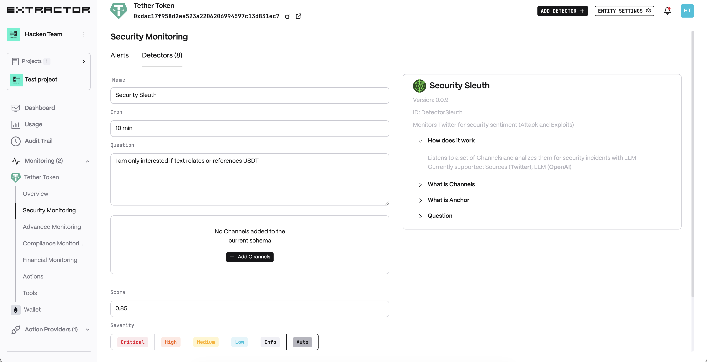
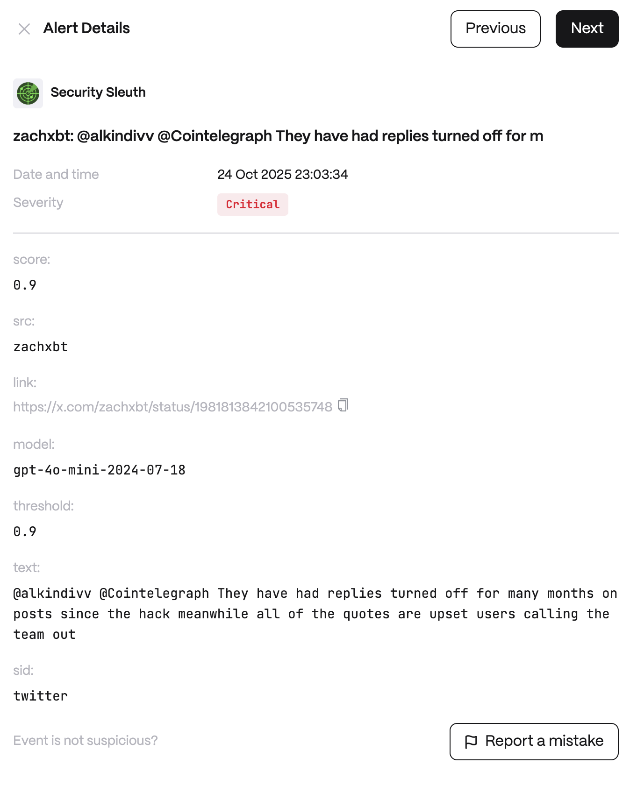

**Behavior**

Listens to a set of Channels and analyses them for security incidents with LLM. Currently supported: Sources (_Twitter_), LLM (_OpenAI_).

**Channels** are additional Twitter accounts (channels) to the predefined list of security information sources.

**Anchor** is a text filter before sentiment analysis to target specific content (for example, messages often have headers or titles). This allows you to improve true positives content for analysis.

**Use cases**

* **Hack Intel from Twitter:** monitor a curated list of Twitter accounts belonging to known blockchain security experts and breach alert channels. When one of these sources tweets about a new exploit, hack, or vulnerability, the monitor's LLM analyzes the tweet's content for credibility and relevance. If it's a valid incident, the system generates an alert with a summary, enabling the team to quickly assess if their organization's systems could be affected by the same issue.

* **Brand Scam Monitoring:** watch Twitter for any mentions of brand coupled with scam indicators. Set an anchor filter, such as the product name plus words like "scam" or "phishing". If the monitor finds a tweet like "Beware, I got a phishing DM pretending to be [WalletName] support," it will process it and alert the team. This heads-up allows the company to immediately notify users (via official channels) about the impersonation attempt and take steps to report or takedown the malicious account.

## Configuration

<Steps>
  <Step title="Name">
    Enter a descriptive name for your monitor, for example: "Security Sleuth".
  </Step>
  <Step title="Cron">
    Enter a cron expression to define the schedule.
  </Step>
  <Step title="Track any change">
    Enable to alert on any detected change.
  </Step>
  <Step title="Question">
    The question or topic to analyse for security relevance.
  </Step>
  <Step title="Channel">
    Additional Twitter account(s) to monitor beyond the predefined sources.
  </Step>
  <Step title="Score">
    Minimum LLM confidence score threshold for generating an alert.
  </Step>
</Steps>

**Alert example**

